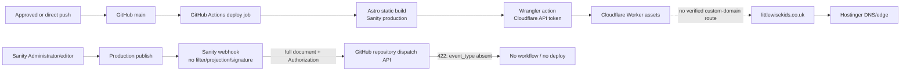
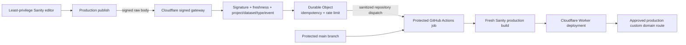

# Deployment Flow

## Current Observed Architecture

## Target Architecture

The prompt's generic gateway-to-Cloudflare-Deploy-Hook option assumes Pages. This repository has a Worker and no Pages project, so the smallest compatible target uses the gateway to sanitize/authenticate GitHub dispatch, then retains the existing Wrangler Worker deployment.

## Triggers And Credentials

| Trigger | Branch/dataset | Credential | Target | Current result |
| --- | --- | --- | --- | --- |
| Push to `main` | `main`; Sanity `production` | GitHub token + `CLOUDFLARE_API_TOKEN` | Cloudflare Worker | Deploys |
| Other branch push | none | none | none | No production deploy |
| Fork pull request | workflow has no PR trigger | no production secret path | none | No deploy |
| `repository_dispatch: sanity-publish` | default branch; production selectors in build | GitHub dispatch credential then Cloudflare token | Cloudflare Worker | Works only for correctly shaped dispatch |
| Current Sanity publish | production | Authorization header stored in Sanity | GitHub API | Rejected `422` |
| Sanity draft save | drafts disabled | none | none | No webhook |
| Media upload | current hook has no filter | current Authorization header | GitHub API | Could attempt and fail; target will exclude irrelevant types |

## Event Answers

- Push to `main`: one Actions job builds production Sanity content and deploys the Worker.
- Another branch: no workflow trigger; no production deploy.
- Fork PR: no deploy workflow trigger and GitHub does not provide repository secrets to fork code on this workflow path.
- Draft edit: webhook drafts are disabled; no intended deploy.
- Publish/unpublish/delete: current unfiltered webhook attempts GitHub and fails shape validation. Target gateway accepts only allowed production operations/types.
- Media upload: current webhook may attempt; target filter/type gate rejects asset-only events.
- Duplicate builds: no Cloudflare native Pages integration was found. Current overlapping publish attempts can race if dispatch is manually generated; local concurrency now serializes production deploys. Target Durable Object deduplicates source events.
- Preview: no explicit preview workflow/project was found.
- Production: push to `main`, and after migration only verified/sanitized gateway dispatch.

## Failure And Rollback

- Build failure: no new Worker version becomes active; inspect Actions logs, correct code/content, rerun protected workflow.
- Gateway rejection: no deploy; inspect redacted invocation status and Sanity attempt status.
- Dispatch failure: gateway removes the processing reservation and returns `502`, allowing Sanity retry.
- Bad Worker deployment: roll back to previous Cloudflare Worker deployment/version; Sanity content remains intact.
- Domain migration failure: restore prior DNS/Hostinger records; Worker remains available on its verified URL.
